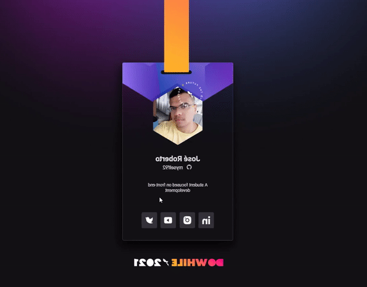
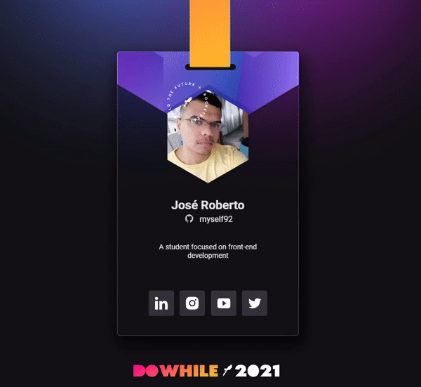

<h1 align="center">
  
</h1>

<h2 align="center">🚀 Badge Do While 2021 - Subscribe to <a href="https://dowhile.io/inscricao">DoWhile 2021</a></h2>

  <a href="#why">Why</a> •
  <a href="#layout">Layout</a> •
  <a href="#tech-stack">Tech Stack</a> • 
  <a href="#api">API</a> • 
  <a href="#project">Project</a> 

<h2 id="Desktop resposive">Desktop</h2>

  
  
   
  

<h2 id="Mobile resposive">Mobile</h2>

  

 

<h2 id="why">🤔 Why?</h2>

<h4>PT-BR</h4>
Este design foi criado pela Rocketseat Boosters e apresentado no NLW Heat, o mais recente NLW da Rocketseat este ano. O projeto apresentado neste repositório foi criado na trilha Origem, onde passamos pelo aprendizado e práticas de HTML, CSS e JavaScript, onde foram ministradas aulas para iniciantes ou para quem quisesse reforçar esse conhecimento teórico e técnico.

<h4>English</h4>
This design was created by Rocketseat Boosters and featured at NLW Heat, Rocketseat's latest NLW this year. The project presented in this repository was created on the Origin track, where we went through the learning and practices of HTML, CSS and JavaScript, where classes were given to beginners or those who wanted to reinforce this theoretical and technical knowledge.

The initial project is completely static and doesn't respond to multiple devices, at the end of the project some challenges were made: Making the aplication bee responsive and making animations. Challenges that I solved by using CSS3.    

<h2 id="layout">🟩 Layout</h2>   

The project layout is in Figma, here at this <a href="https://www.figma.com/file/bVPY9Y6300VXwMf522hnCt/%5BNLW-Heat---Mission%3A-Origin%5D-DoWhile2021-(Community)">link</a>
  

<h2 id="tech-stack">🚀 Tech Stack</h2>
<ul>
  <li><a href="https://developer.mozilla.org/en-US/docs/Web/HTML">HTML</a></li>
  <li><a href="https://developer.mozilla.org/en-US/docs/Web/CSS">CSS</a></li>
  <li><a href="https://developer.mozilla.org/en-US/docs/Web/JavaScript/Reference">JavaScript</a></li>
</ul>  

<h2 id="api">🗺️ API</h2>
<ul>
 <li><a href="https://api.github.com/">GitHub</li>
 
</ul>    

<h2 id="project">🔨 Project</h2>
<ul>
 <li><a href="https://roberto-devL.github.io/Badge-doWhile2021/">Badge DoWhile 2021</li>
</ul>

<h2 align="center">🤝 Como Contribuir?</h2>
 

⭐️ Deixe sua estrela 
🐛 Encontre e reporte bugs 
📥 Envie PRs para ajudar a resolver bugs 
↪️ Compartilhe o Repositório

